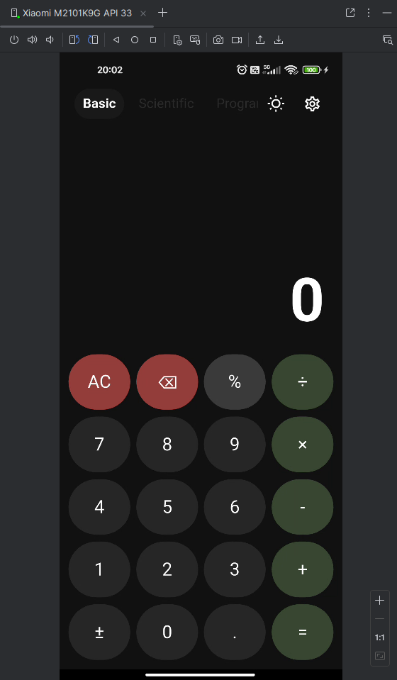
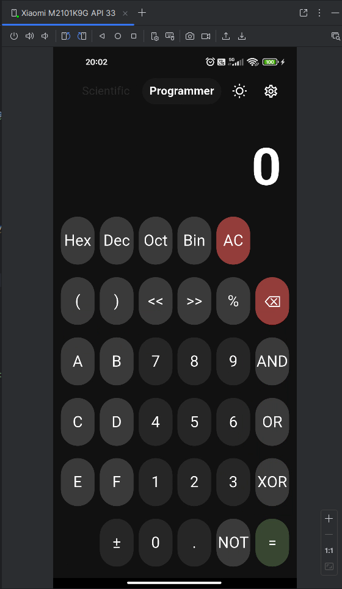
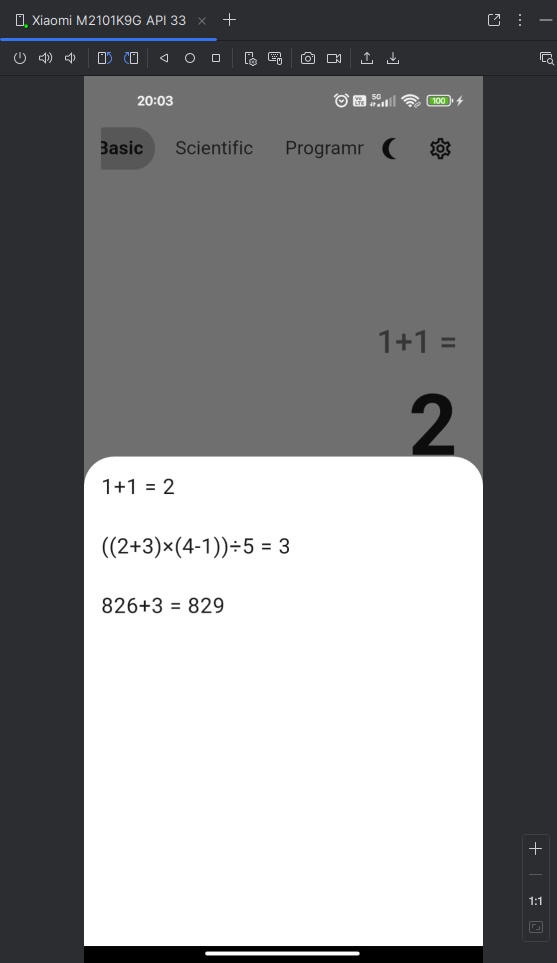
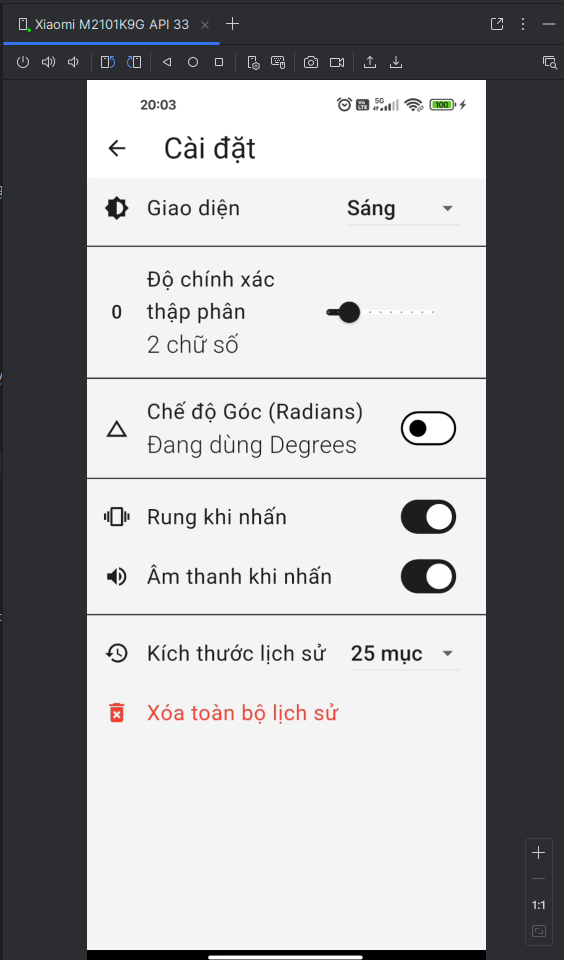
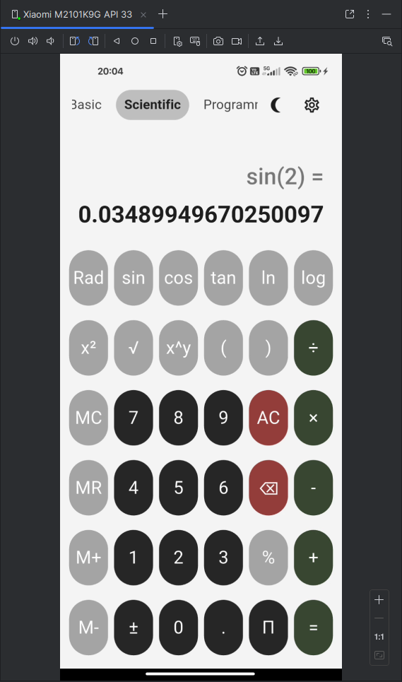
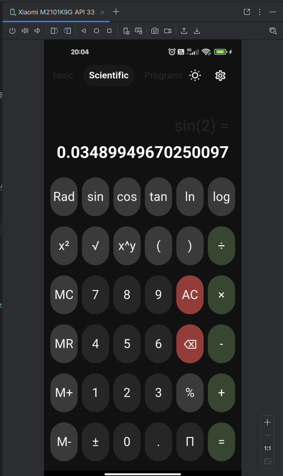

```markdown
<div align="center">

# 🧮 Máy Tính Nâng Cao (Advanced Calculator)
**Dự Án Bài Tập Chương 3 - Phát Triển Ứng Dụng Flutter**

[](https://flutter.dev/)
[](https://dart.dev/)
[](https://opensource.org/licenses/MIT)

</div>

---

## 📝 Mô Tả Dự Án

**Máy Tính Nâng Cao** là ứng dụng đa năng được thiết kế để giải quyết mọi nhu cầu tính toán từ cơ bản đến phức tạp. Ứng dụng tập trung vào trải nghiệm người dùng với giao diện trực quan, hỗ trợ đa chế độ và khả năng tùy biến cao.

### ✨ Các Tính Năng Chính

* 🧮 **Chế Độ Cơ Bản:** Thực hiện các phép toán số học (+, -, ×, ÷) nhanh chóng.
* 🔬 **Chế Độ Khoa Học:** Hỗ trợ lượng giác (sin, cos, tan), logarit, lũy thừa, căn bậc và hằng số (π, e).
* 👨‍💻 **Chế Độ Lập Trình:** Chuyển đổi hệ cơ số (Hex, Dec, Oct, Bin) và phép toán Bitwise.
* 📜 **Lịch Sử & Bộ Nhớ:** Tự động lưu lịch sử tính toán và hỗ trợ các phím nhớ (M+, MR...).
* 🎨 **Giao Diện Hiện Đại:** Hỗ trợ Dark Mode/Light Mode và tương thích nhiều kích thước màn hình.

---

## 📸 Ảnh Chụp Màn Hình

<div align="center">

| **Chế Độ Cơ Bản** | **Chế Độ Khoa Học** |
|:---:|:---:|
|  <br> *Giao diện tính toán cơ bản* |  <br> *Hỗ trợ hàm toán học phức tạp* |

| **Chế Độ Lập Trình** | **Lịch Sử Tính Toán** |
|:---:|:---:|
|  <br> *Chuyển đổi hệ số & Bitwise* |  <br> *Xem lại các phép tính cũ* |

| **Cài Đặt** | **Giao Diện Sáng / Tối** |
|:---:|:---:|
|  <br> *Tùy chỉnh giao diện & dữ liệu* |   <br> *Theme Sáng & Tối* |

</div>

---

## 🏗️ Sơ Đồ Kiến Trúc


[Image of Calculator Logic Flowchart]


```mermaid
graph TD;
    subgraph UI [Giao Diện Người Dùng]
        Display[Màn Hình Hiển Thị]
        Keypad[Bảng Nút]
        ModeSel[Bộ Chọn Chế Độ]
    end

    subgraph Controller [Bộ Điều Khiển]
        InputHandler[Xử Lý Đầu Vào]
        ModeMgr[Quản Lý Chế Độ]
        Router[Định Tuyến Sự Kiện]
    end

    subgraph Logic [Lớp Logic]
        BasicEng[Engine Cơ Bản]
        SciEng[Máy Tính Khoa Học]
        ProgEng[Máy Tính Lập Trình]
    end

    subgraph Data [Quản Lý Dữ Liệu]
        History[Lưu Trữ Lịch Sử]
        Memory[Quản Lý Bộ Nhớ]
        Settings[Cài Đặt/Theme]
    end

    UI --> Controller
    Controller --> Logic
    Logic --> Data

## Hướng Dẫn Cài Đặt

**Các Bước Cài Đặt:**

1.  **Clone kho lưu trữ:**
    ```bash
    git clone git@github.com:LeTien0811/flutter_advanced_calculator_LeVietTien.git
    cd AdvancedCalculator
    ```
2. **Chạy ứng dụng:**
    ```bash
    flutter run -d web-server
    # hoặc
    flutter run 
    ```
3. **Truy cập ứng dụng:** Mở trình duyệt và truy cập

## Hướng Dẫn Kiểm Thử

**Chạy Unit Tests:**

```bash
flutter test
```

**Kiểm Tra Thủ Công:**

*   **Chế Độ Cơ Bản:** Kiểm tra các phép toán cộng, trừ, nhân, chia, dấu thập phân, xóa và quay lại.
*   **Chế Độ Khoa Học:** Kiểm tra các hàm lượng giác, logarit, lũy thừa, căn bậc, và các hằng số.
*   **Chế Độ Lập Trình:** Kiểm tra các phép chuyển đổi hệ số và các phép toán bitwise.
*   **Các Tính Năng Bổ Sung:** Kiểm tra chức năng lưu lịch sử, bộ nhớ, chuyển đổi chế độ và xử lý lỗi.

## Hạn Chế

*   **Độ Chính Xác:** Các phép tính dấu phẩy động có thể gặp sai số nhỏ trong một số trường hợp.
*   **Khả Năng Tương Thích:** Ứng dụng được tối ưu hóa cho các trình duyệt hiện đại.
*   **Hiệu Năng:** Lịch sử tính toán có giới hạn để đảm bảo hiệu năng.
*   **Xác Thực Đầu Vào:** Một số trường hợp biên trong chế độ lập trình có thể chưa được xác thực đầy đủ.

## Cải Tiến Tương Lai

*   **Phím Tắt:** Thêm phím tắt cho các phép toán phổ biến.
*   **Chủ Đề:** Triển khai công tắc chủ đề tối/sáng.
*   **Chuyển Đổi Đơn Vị:** Thêm tính năng chuyển đổi đơn vị (độ dài, trọng lượng, nhiệt độ).
*   **Cải Thiện Thông Báo Lỗi:** Cung cấp thông báo lỗi chi tiết và gợi ý.
*   **Vẽ Đồ Thị:** Thêm chức năng vẽ đồ thị cho các phương trình.
*   **Hỗ Trợ Đa Ngôn Ngữ:** Mở rộng hỗ trợ đa ngôn ngữ.
*   **Đồng Bộ Hóa Đám Mây:** Cho phép đồng bộ hóa lịch sử tính toán trên nhiều thiết bị.

## Công Nghệ Sử Dụng

*   **Framework:** Flutter
*   **Testing:** flutter_test Library

## Đóng Góp

Đóng góp cho dự án luôn được hoan nghênh! Vui lòng làm theo các bước sau:

1.  Fork kho lưu trữ.
2.  Tạo một nhánh mới (`git checkout -b feature/AmazingFeature`).
3.  Thực hiện thay đổi của bạn.
4.  Commit các thay đổi (`git commit -m 'Add some AmazingFeature'`).
5.  Đẩy lên nhánh (`git push origin feature/AmazingFeature`).
6.  Mở một Pull Request.

## Giấy phép

Dự án này được cấp phép theo Giấy phép MIT - xem file [LICENSE](LICENSE) để biết chi tiết.

## Tác Giả

**[Lê Việt Tiến]**
- Mã số sinh viên: [2224801030398]
- Email: [letien2081@gmail.com]
- GitHub: [@LeTien0811]

---

*Cập nhật lần cuối: 26 tháng 11 năm 2023*
```
